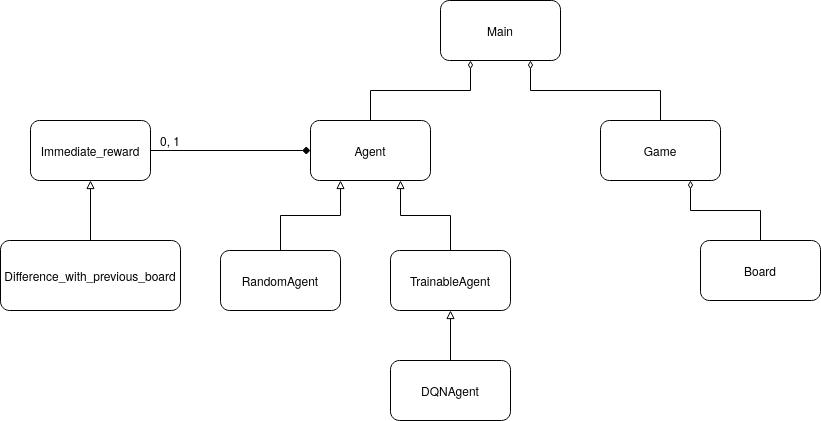

# Othello

Run main.py to train 2 deep Q learning agents, and then let them play against an agent of your choosing.

Note: this is just example code: many parameters, classes and methods will need to be added/adapted to get a good end result.

